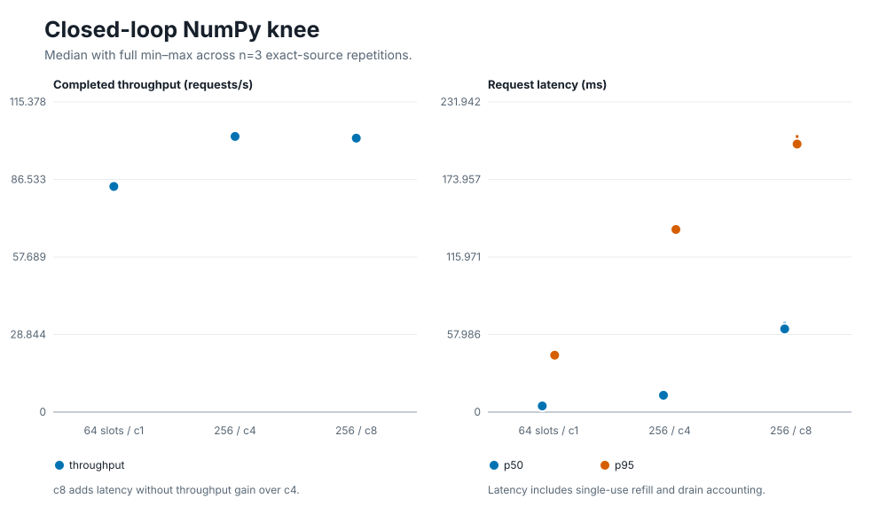
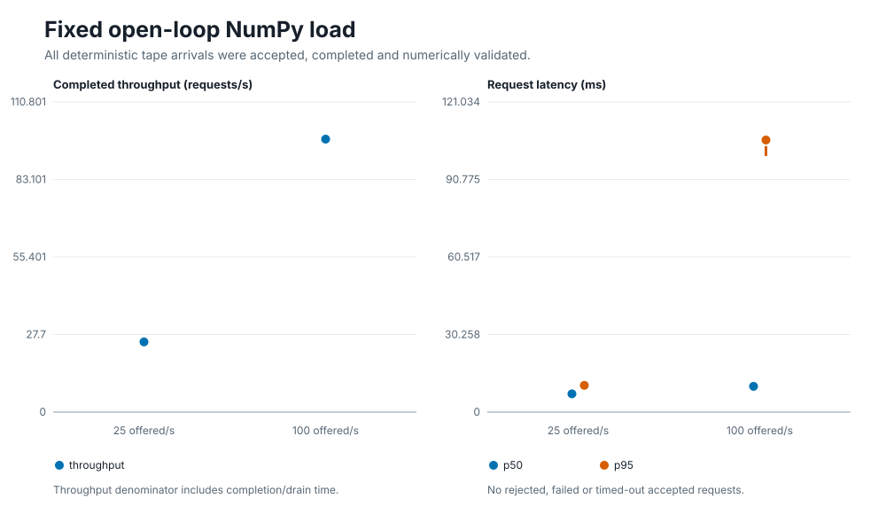
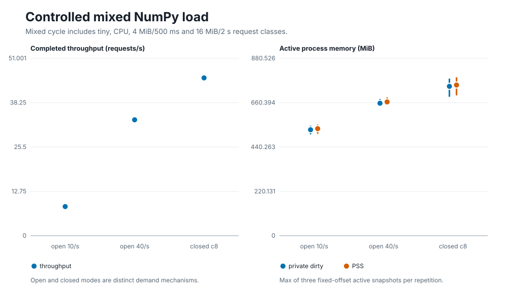

# Phase 6 NumPy-ready COW density and load qualification

Published: 2026-08-08

## Executive conclusion

The bounded T4 corpus supports retaining `profile-candidate` for the NumPy-ready, fixed-memory, single-use COW path under the exact tested input surface: 8 GiB benchmark budget, 2 GiB reserve, 4 CPU, greed 50, up to 256 ready slots, and at most 8 benchmark consumers. The formal run completed 24/24 independently validated records—eight retained cells with three exact-source repetitions—without a rejected, failed, timed-out, numerically invalid, OOM, OOM-kill, PSI, or prepared-pool failure event.

The pure NumPy closed-loop knee was at four consumers on this worker: median throughput was 102.54 requests/s. Moving from four to eight consumers changed throughput by -0.62%, while median p50 latency rose 4.94× and p95 rose 1.47×. The compiled `max_active=10` remains a safety envelope, not an observed throughput optimum. No compiler-policy change is justified from this one bounded environment; a soft operating target near four active pure-NumPy requests is the performance implication to test next.

The result does not qualify production deployment, provider behavior, source authenticity, arbitrary replay, cross-machine performance, or CPU/cgroup enforcement. Digest fields establish consistency identity only.

## Provenance and acceptance

| Boundary | Exact value |
|---|---|
| Formal Host revision | `17872d6a1d52c58cfa4b55826c1a5ef43ed19529` |
| Host tree | `e8652d8fff31894ca56cbae2a6464992002124fa` |
| Guest source revision | `64666a5aaacf8555f65d47f75c77796432e141e8` |
| Guest artifact SHA-256 | `f00f22ac94a66f2f2e67573da11ef879f8b5e46622eb9379300cc1e6a5b40a30` |
| Guest manifest SHA-256 | `458a4e4bbec1ad225f0f3c38357738f1937b1e16d5388f76cdf4c460ce6839fa` |
| Artifact memory contract | `2048 == 2048` Wasm pages, `fixed=true`, `cow_eligible=true` |
| Linux benchmark SHA-256 | `09253ed8b664337863769523707f0a467cd19ec146013ddc435e15fe2749d893` |
| Controller validator SHA-256 | `b0ea4daec2bd8ab6d18627f80bca4cbb2aa23641f0662672e2d5c2e07efeb359` |
| Formal selection SHA-256 | `2c35b00b352bc3b3dfea7ea10b28d776e18ec847e3283b6c978c92b8745e9b0f` |
| Formal job / archive | `271717` / `fe3077a0621b83459b3991b28e9506145080331d7f640039d9123d9be5a5b059` |
| Formal records | 24/24 accepted; three repetitions per retained cell |
| Small job / archive | `271714` / `732d7670d4b5b28c30108ff06900d78897fee2d8b63ae70cea9bb6ecdbab0d48` |
| Scheduler resource shape | T4 partition, `tesla_t4:1`, 1 node, 1 task, 4 CPU, 16 GiB allocation |
| Benchmark limits | 8 GiB runtime budget, 2 GiB reserve, 4 CPU, greed 50 |
| Environment | Linux/amd64, kernel `6.17.0-35-generic`, Go `1.26.0`, cgroup v2 |

The T4 is the controlled allocation stratum; this workload does not claim GPU acceleration. `scontrol` verified `COMPLETED/0:0` and the resource shape. The cluster `sacct` daemon was unavailable, so `sacct_verified=false`; acceptance did not depend on it. Both jobs completed the full handshake:

```text
READY → same-FD bounded pull → checksum/file-set validation → safe extraction
→ exact standalone validation → hash-bound controller ACK → remote ACKED
→ scontrol COMPLETED/0:0 and resource-shape verification
```

The checked-in report contains derived values only. Raw evidence remains outside the repository at the controller roots recorded by the run operator.

## Evidence strength and formal selection

The accepted v16 small matrix screened 11 unique cells. Formal retention was frozen before submission and then SHA-bound into the exact payload. It retained:

- the 64-slot/one-consumer reference;
- the 256-slot four-consumer knee and eight-consumer saturation point;
- pure NumPy open-loop 25/s and 100/s;
- mixed closed-loop eight-consumer load;
- mixed open-loop 10/s and 40/s.

Excluded screening cells remain in the small archive:

- 64-slot c4 and c8 added little throughput over c1 while increasing latency;
- mixed closed-loop c4 was the lower member of the same mechanism; c8 retained the bounded upper point.

The earlier accepted v13 canary used a different Host revision and is transport/mechanism evidence only. It is not pooled into the formal curves. Failed, cancelled, diagnostic, partial, or un-ACKed jobs are excluded.

Every range below is the full min–max of three raw repetitions; it is descriptive, not a confidence interval. Exact raw values are retained in [`phase6-summary.json`](phase6-numpy-density-assets/phase6-summary.json).

## Closed-loop question: where is the pure NumPy knee?



| Cell | Throughput req/s | p50 ms | p95 ms | p99 ms | Refill drain ms |
|---|---:|---:|---:|---:|---:|
| s64 c1 | 83.93 [83.04–84.02] | 4.6 [4.4–4.6] | 42.6 [39.7–44.1] | 76.8 [58.3–79.8] | 314.9 [308.9–345.8] |
| s256 c4 | 102.54 [101.24–103.02] | 12.6 [12.0–14.7] | 136.6 [134.7–137.8] | 184.2 [177.3–190.6] | 2935.3 [2920.3–2961.4] |
| s256 c8 | 101.90 [101.17–102.19] | 62.2 [61.1–67.3] | 200.4 [199.9–207.1] | 261.2 [242.9–274.1] | 2905.5 [2890.1–3052.6] |

Four consumers reached the observed throughput knee. Eight consumers preserved completion and recovery but traded queueing latency for no throughput gain. Refill drain is outside request latency and is reported separately.

## Open-loop question: does the fixed arrival tape remain conserved?



| Offered rate | Offered / accepted / completed per repetition | Throughput req/s | p50 ms | p95 ms | p99 ms |
|---:|---:|---:|---:|---:|---:|
| 25/s | 250 / 250 / 250 | 25.07 [25.07–25.08] | 7.1 [7.1–7.2] | 10.4 [10.3–10.5] | 10.6 [10.6–10.7] |
| 100/s | 1000 / 1000 / 1000 | 97.51 [97.44–98.93] | 10.0 [8.6–10.6] | 106.2 [99.9–108.1] | 168.8 [152.4–183.3] |

All deterministic arrivals were accepted and completed; there were no queue rejections. Throughput uses the measured completion/drain duration, so it is slightly below the configured 100/s issuance rate at the higher point. This fixed tape is a benchmark mechanism, not a production arrival distribution.

## Mixed-load question: how do dirty classes change load and memory?



The deterministic 20-request cycle contains 12 tiny, 5 CPU, 2 × 4 MiB/500 ms dirty-hold, and 1 × 16 MiB/2 s dirty-hold request. Its tail latency therefore reflects the named class durations as well as scheduling.

| Cell | Throughput req/s | p95 ms | p99 ms | Active private dirty MiB | Active PSS MiB | CPU cores |
|---|---:|---:|---:|---:|---:|---:|
| open 10/s | 8.37 [8.37–8.38] | 526.6 [526.2–526.9] | 2046.1 [2046.1–2048.6] | 525.9 [502.9–545.9] | 531.3 [506.4–551.7] | 0.48 [0.48–0.49] |
| open 40/s | 33.32 [33.29–33.32] | 521.0 [520.1–529.8] | 2037.0 [2036.9–2037.1] | 657.6 [655.2–678.8] | 663.9 [661.8–686.2] | 1.61 [1.59–1.61] |
| closed c8 | 45.37 [44.87–45.54] | 567.7 [554.6–647.4] | 2046.3 [2043.9–2047.9] | 741.3 [689.7–779.7] | 747.8 [696.3–786.2] | 2.33 [2.32–2.36] |

Active memory is the maximum of three fixed-offset `smaps` samples in each repetition. Open and closed lanes are distinct demand mechanisms and are not ranked as if they were the same workload.

## Density, accounting, and recovery

- The formal corpus served 15,582 requests. All 15,582 were accepted, completed, and passed the `numpy-exact-v1` result oracle; rejected, failed, and timed-out totals were zero.
- Every final snapshot restored `ready_after` to the requested 64 or 256 slots with zero leased, executing, waiting, queued, refilling, or retiring slots and zero pool failures.
- Every observed prepared-image generation was `c4a4534c8bfd8e455c6bd4cfa790c7b91d4464944c726c285b9840bfaf9205e8`.
- A 256-slot snapshot exposes 32 GiB of virtual alias space over a fixed 128 MiB Guest memory contract. This is virtual mapping coverage, not physical consumption or a marginal-per-slot physical-memory estimate.
- Prepared-image allocated-block census varied from 63.29 to 79.34 MiB while the immutable generation identity remained fixed. The census is dynamic telemetry, not image identity.
- The largest measured active mixed-load process PSS was 786.18 MiB; largest active private dirty was 779.70 MiB.
- Job-scoped cgroup `memory.peak` was 1,353.66 MiB, but it is cumulative/shared across sequential cells and cannot be attributed to an individual cell. No cgroup OOM, OOM-kill, or measured PSI-some event occurred.
- All recovery completed. The largest pure-lane replenish drain was 3,052.61 ms; lifecycle A (shard creation), B (NumPy warmup), C (ready-slot request), request latency, and post-load refill remain separate measurements.

## Policy conclusion

For the exact 8 GiB / 2 GiB reserve / 4 CPU / greed 50 input:

1. Retain `profile-candidate` for the bounded `numpy-core` / `cow-fixed` corpus.
2. Keep the compiled `max_active=10` as an admission safety envelope. Formal performance evidence covers consumers 1, 4, and 8; it does not qualify 10 concurrent consumers.
3. Treat four active pure-NumPy consumers as the observed T4 worker knee. Evaluate a derived soft operating target near four before changing the compiler; do not infer a universal limit from one machine/workload stratum.
4. Keep 256 ready slots eligible under the tested budget: all final inventories recovered and no pressure/failure gate fired. This does not establish deployment-layer reservation or kernel enforcement.
5. Preserve immediate tightening on OOM, PSI, or inventory exhaustion. Their absence in this corpus is not permission to remove those fail-closed paths.
6. Stop broad matrix expansion. The current corpus covers baseline, knee, saturation, open-loop conservation, dirty-rate growth, numerical correctness, and recovery. Further runs should answer a named policy question.

## Reproduction

With the accepted private formal controller root present:

```bash
python3 tools/phase6_report.py \
  --formal-root /tmp/pysolate-p6-formal-271717/job-271717 \
  --output-dir docs/reports/phase6-numpy-density-assets

(cd docs/reports/phase6-numpy-density-assets && shasum -a 256 -c SHA256SUMS)
python3 -m unittest tools/test_phase6_report.py -v
```

The renderer rejects duplicate JSON keys, requires the exact ACK and source identities, verifies every evidence digest in the accepted run manifest, requires the exact 8 × 3 cell/repetition matrix, recomputes all statistics from raw records, emits a fixed output set, and writes a SHA-256 manifest. Two consecutive renders were byte-identical; all three SVGs were visually inspected for units, range marks, labels, overlap, and clipping.

## Forbidden inferences

This report does not establish:

- production qualification or production traffic behavior;
- provider final-state proof, live or arbitrary replay, or source authentication;
- semantic equivalence between native CPython and the Wasm Guest;
- performance gain over native Python or another runtime;
- cross-machine, cross-GPU, cross-kernel, or cross-workload ranking;
- physical memory equal to virtual alias size;
- per-cell attribution of shared cgroup peak counters;
- kernel CPU quota or memory-limit application/read-back;
- safety of growable, unbound, or non-`cow-fixed` artifacts.
