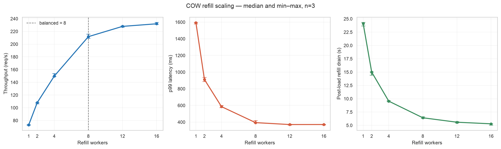
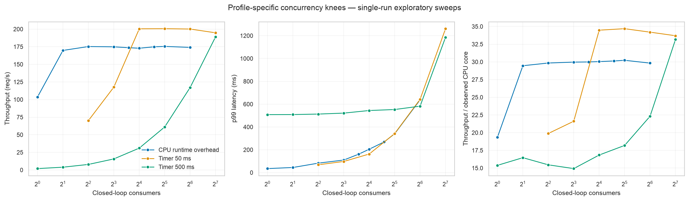
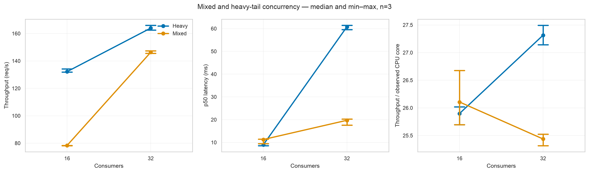
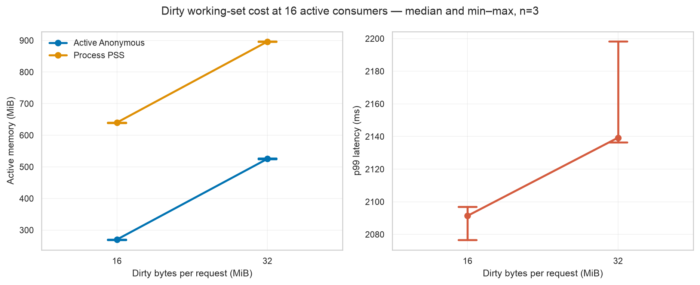
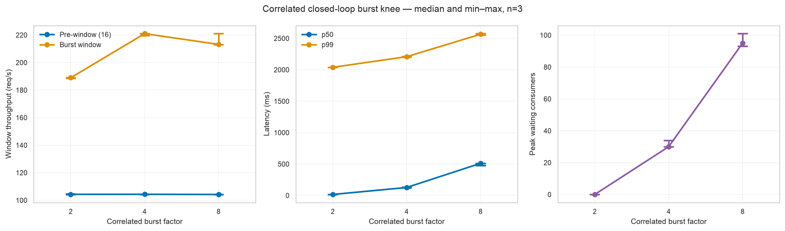
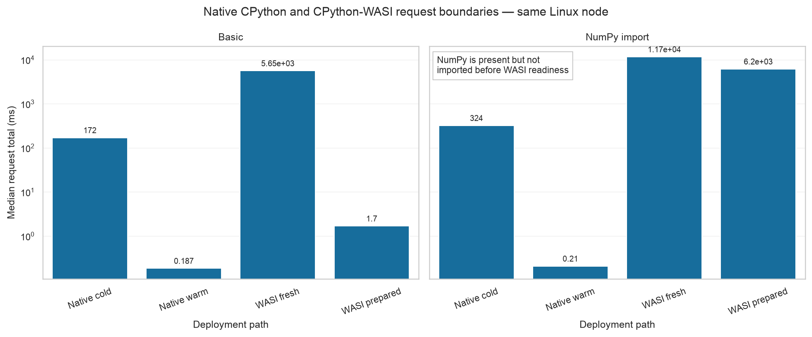

# Host-governed COW scheduler experiment report

## Executive summary

The experiments support a bounded Host-governed CPython-WASI COW scheduler, not an unrestricted production-overcommit claim. Under the repeated mixed workload, 32 consumers delivered 146.32 req/s, while the correlated burst experiment showed a clear saturation knee: a 4× step from 16 to 64 consumers reached 220.99 req/s in the burst window but exhausted ready inventory and introduced a median of 30 waiting consumers; an 8× step did not improve throughput and increased median p50 latency to 511 ms. The repeated refill sweep found 8 workers to be the balanced operating point at 91.29% of the 16-worker throughput peak, while 12 workers reached 98.24%.

The production library therefore keeps 4 refill workers as a conservative automatic default, uses 8 for the main controlled experiments, and treats higher values as explicit tuning. `ProductionPolicy` compiles maximum memory, maximum CPU, and greed into bounded watermarks, concurrency, reservation, retry, and control-loop policy; it does not apply cgroup limits or enable a public production-overcommit path.

## Evidence and reproducibility

All plotted repeated results use:

| Property | Value |
|---|---|
| Host source | `d6f6702f9462ec58705f05786a9ea58ba2baba1c` |
| Guest artifact SHA-256 | `e32b9ff8ebb60f6e970b0b25d19299e13e066b38fa499ee7a4980e47a9257bef` |
| Guest source | `ef1732c52a48c3766e942de05c2cfaf6e9d7e0e2` |
| Guest target | `wasm32-wasip1`, reactor |
| Kernel | Linux `6.17.0-35-generic`, amd64 |
| Go | `go1.26.0` |
| Cgroup | v2 |
| Allocation / runtime / reserve | 20 GiB / 16 GiB / 4 GiB |
| Page size | 4096 bytes |

Repeated points report the median and the full min–max range over three sequential repetitions on one node. These ranges are not confidence intervals and do not establish cross-node variance.

The checksum-verified private evidence roots are:

```text
.artifacts-private/paper-repeat/job-267985/
.artifacts-private/refill-repeat/job-267987/
```

The CPU and timer concurrency figure is an explicitly exploratory single-run comparison from older, separately verified revisions:

```text
CPU:   d6df17be59de626a53c5c374cbb552d0c8d53ca1, job 267926
timer: 23384d236f2e84e5da900d2f50d54a7ba7b96ad5, job 267934
```

Those points share the same Guest artifact and platform but are not merged statistically with the repeated `d6f6702` results.

Regenerate all figures from repository root:

```bash
uv run \
  --with 'matplotlib==3.11.1' \
  --with 'pandas==2.3.3' \
  --with 'seaborn==0.13.2' \
  python scripts/plot_scheduler_experiments.py
```

The script asserts the expected source revisions before plotting.

## 1. Mechanism and capacity gate

The retained E1 mechanism gate is source `282116d1dc77054477aa65cfcb88b0e32a749c6e`, job `267772`, on Linux x86-64 with a 4 GiB memory cgroup, 128 MiB linear memory, and 120 samples. It verifies bounded live mapping observation, cancellation, and reclaim behavior. It is a mechanism gate, not mixed-workload throughput or production evidence. No capacity curve is plotted because the retained local E1 files do not contain a machine-readable metric table suitable for plotting.

Failed or incomplete jobs, including the first dirty matrix, are excluded from result curves.

## 2. Refill scaling

Fixed conditions: 1024 ready slots, 64 closed-loop consumers, 30 seconds, controlled CPU runtime workload, three repetitions.



| Workers | Throughput median (range), req/s | p99 median, ms | CPU cores median | Drain median, s | % of 16-worker peak |
|---:|---:|---:|---:|---:|---:|
| 1 | 73.00 (72.81–73.34) | 1593 | 1.33 | 24.14 | 31.47% |
| 2 | 108.07 (106.36–108.51) | 911 | 2.41 | 15.01 | 46.59% |
| 4 | 149.78 (149.10–153.95) | 586 | 4.10 | 9.55 | 64.57% |
| 8 | 211.76 (209.31–215.82) | 393 | 6.77 | 6.42 | 91.29% |
| 12 | 227.91 (226.67–228.71) | 371 | 7.90 | 5.59 | 98.24% |
| 16 | 231.98 (231.32–234.45) | 371 | 8.11 | 5.29 | 100% |

The 4→8 transition adds 41.39% throughput. The 8→12 transition adds only 7.62% throughput while observed CPU use rises 16.66%; 12→16 adds 1.79%. Eight workers therefore capture most of the attainable throughput without treating the peak setting as the default.

## 3. Profile-specific concurrency

The exploratory CPU and controlled WASI timer sweeps demonstrate why active concurrency cannot be equated with CPU count.



For the lightweight CPU/runtime-overhead profile, 4 consumers reached 99.89% of the observed maximum throughput, with p99 82.8 ms. Raising concurrency to 32 did not materially increase throughput but raised p99 to 340.1 ms.

For the controlled 50 ms timer profile, 16 consumers reached 99.91% of maximum observed throughput with p99 162.7 ms; 32 consumers preserved throughput but raised p99 to 342.1 ms. The controlled 500 ms timer profile continued to gain throughput through 128 consumers, but p99 reached 1185.8 ms. These are deterministic WASI timer waits, not real network or provider latency.

## 4. Repeated mixed and heavy-tail workloads

`mixed-v1` uses a deterministic 20-request cycle:

```text
60% tiny CPU
25% controlled 50 ms timer wait
10% 4 MiB dirty + 500 ms hold
 5% 16 MiB dirty + 2 s hold
```

`heavy-tail-v1` uses 95% tiny CPU and 5% controlled 2 s timer tail. Schema v9 records actual per-class started, completed, and failed counts.



| Profile | Consumers | Throughput median (range), req/s | p50 median, ms | p99 median, ms | CPU cores | req/s per observed core |
|---|---:|---:|---:|---:|---:|---:|
| Mixed | 16 | 78.37 (78.16–78.41) | 11.28 | 2030.66 | 2.99 | 26.18 |
| Mixed | 32 | 146.32 (145.51–147.30) | 19.72 | 2043.08 | 5.75 | 25.46 |
| Heavy-tail | 16 | 132.19 (131.92–134.17) | 8.96 | 2013.56 | 5.13 | 25.75 |
| Heavy-tail | 32 | 163.97 (162.61–166.04) | 60.79 | 2076.45 | 6.04 | 27.15 |

Mixed 16→32 increases throughput 86.71% while p50 rises 74.92%; throughput per observed CPU core is nearly flat. Heavy-tail 16→32 increases throughput only 24.04%, while p50 grows 6.79×. The appropriate concurrency knee is therefore profile-specific.

## 5. Dirty working-set cost

Fixed conditions: 16 active consumers, 2 second controlled hold, three repetitions.



| Dirty/request | Throughput, req/s | p99, ms | Active Anonymous, MiB | Process PSS, MiB |
|---:|---:|---:|---:|---:|
| 16 MiB | 7.76 | 2091 | 270.1 | 640.2 |
| 32 MiB | 7.61 | 2139 | 525.4 | 896.4 |

Doubling dirty bytes raises active Anonymous by 1.95× and process PSS by 256.2 MiB. Every accepted repetition completed with zero failed or timed-out requests, complete replenishment, 256 ready instances after drain, and zero final COW `Private_Dirty` and `Anonymous` bytes.

A 64 MiB single-request attempt exposed a Guest `MemoryError` and an empty-exception diagnostic bug. The diagnostic contract was fixed, but the Guest artifact was not rebuilt for this result set; 64 MiB is therefore retained as a boundary observation, not an accepted success point.

## 6. Correlated burst knee

The burst experiment starts with 16 closed-loop consumers. At the five-second midpoint it releases additional consumers once, producing peaks of 32, 64, or 128. This is a correlated closed-loop demand step, not an open-loop arrival trace.



| Burst | Peak consumers | Pre-window req/s | Burst-window req/s | Gain | Overall req/s | p50, ms | p99, ms | Waiting median |
|---:|---:|---:|---:|---:|---:|---:|---:|---:|
| 2× | 32 | 104.30 | 188.97 | 1.81× | 125.41 | 16.03 | 2038.95 | 0 |
| 4× | 64 | 104.32 | 220.99 | 2.12× | 138.97 | 127.08 | 2208.23 | 30 |
| 8× | 128 | 104.21 | 213.19 | 2.05× | 137.56 | 511.47 | 2565.23 | 95 |

The 2× burst remains below saturation. At 4×, ready inventory reaches zero and waiting appears. At 8×, throughput no longer improves, while median p50 and waiting increase sharply. For this controlled mixed profile, 32 active attempts are efficient, 64 is a short-burst upper region, and 128 is over-saturated.

## 7. Platform-normalized interpretation

“Throughput per observed CPU core” divides request throughput by benchmark process CPU time divided by wall time. It is useful within one platform and artifact, but it is not a cross-architecture normalization and does not account for external service work.

Representative repeated values:

| Point | req/s per observed core |
|---|---:|
| Mixed, 16 consumers | 26.18 |
| Mixed, 32 consumers | 25.46 |
| Heavy-tail, 16 consumers | 25.75 |
| Heavy-tail, 32 consumers | 27.15 |
| Burst 2× | 26.01 |
| Burst 4× | 25.92 |
| Burst 8× | 25.48 |

The near-flat normalized mixed and burst values show that extra concurrency primarily exposes more CPU capacity until inventory saturation. The heavy-tail profile gains some normalized throughput by hiding deterministic waits. Dirty 32 MiB falls from 15.54 to 11.85 req/s per observed core relative to dirty 16 MiB because page touching adds CPU and memory-system work without reducing the fixed two-second hold.

## 8. Native CPython deployment baseline

A separate direct baseline on `gpuvm36` compares native CPython and CPython-WASI on the same allocated Linux node. It uses Host revision `84d6f3711e4c0e042faea955c4422e0de9ec33f5`. Native CPython 3.14.0 was built from the release source with SHA-256 `88d2da4eed42fa9a5f42ff58a8bc8988881bd6c547e297e46682c2687638a851`; NumPy 2.5.1 came from the CPython 3.14 manylinux x86-64 wheel with SHA-256 `54ad769f17bc2d833b620851989f62054fb9ab93c969d9e1dc3c8e3d56beea21`. The persistent environment is retained under the private Bitbucket experiment root.

The native harness executes the checked-in `guest/bootstrap/agent_runtime` request protocol. “Native cold” includes process spawn, CPython startup, bootstrap import, trusted prepare, execute, JSON framing, and process shutdown. “Native warm” is a persistent interpreter whose bootstrap and trusted prepare have already completed; it measures subsequent request round trips. The WASI totals are Host request totals and use ten samples; native points use 100 samples. All table entries are medians.



The figure uses a logarithmic latency axis because the measured paths span more than four orders of magnitude.

| Fixture / path | Request total, ms | Runtime init, ms | Prepare, ms | Execute, ms |
|---|---:|---:|---:|---:|
| Basic, native cold | 171.507 | n/a | 0.031 | included |
| Basic, native warm | 0.187 | precompleted | precompleted | included |
| Basic, WASI fresh | 5647.797 | 5618.354 | 0.258 | 1.190 |
| Basic, WASI prepared | 1.705 | precompleted | 0.315 | 1.278 |
| NumPy, native cold | 324.132 | n/a | 147.557 | included |
| NumPy, native warm after import | 0.210 | precompleted | precompleted | included |
| NumPy, WASI fresh | 11734.886 | 5710.006 | 6004.357 | 1.229 |
| NumPy, WASI prepared | 6200.491 | precompleted | 6199.138 | 1.229 |

For the basic fixture, prepared CPython-WASI removes 5646.09 ms from the measured request path relative to fresh CPython-WASI, a 99.970% reduction and a 3312.99× fresh/prepared ratio. The fresh WASI path is 32.93× the native cold deployment path; the prepared WASI request is 9.14× the native warm request. These ratios describe this tiny protocol fixture, not arbitrary Python execution speed.

The NumPy result has a different and important boundary. The `numpy-core` artifact contains NumPy 2.5.1, but the prepared pool preinitializes the CPython runtime only; it does **not** import NumPy before the instance becomes ready. Consequently, `import numpy` remains in trusted prepare and costs about 6.20 seconds on every single-use prepared Guest. Preparation reduces NumPy fresh-to-prepared request time by only 47.16% (1.89×), primarily by removing the separate CPython runtime initialization. It does not remove NumPy import. The native warm point has NumPy cached in a persistent interpreter, so comparing its 0.210 ms request directly with the current WASI prepared 6200.491 ms request would mix different prepared-state boundaries and is not reported as a meaningful speedup ratio.

The NumPy artifact remains `profile-candidate`, not `production-safe`. A valid claim that NumPy itself is prewarmed requires a future prepared-image profile that imports NumPy before readiness and then verifies restore isolation and COW behavior.

The checksum-verified private evidence is:

```text
.artifacts-private/native-numpy/job-268015/
```

Slurm job `268015` completed with wrapper exit zero and all six benchmark JSON files passed schema/semantic and checksum validation. Slurm accounting (`sacct`) was unavailable because its persistent database connection failed; `scontrol`, wrapper exit, per-command GNU time records, payload/result manifests, and JSON validation form the retained audit chain. Identity job `268018` additionally records the native executable, NumPy path, Linux/glibc platform, bundled OpenBLAS linkage, and extension `ldd` output.

## 9. Production policy implications

The data supports these bounded defaults and compiler choices:

1. Keep automatic refill workers at 4 for conservative production behavior; use 8 as the balanced experimental setting.
2. Treat active concurrency as a profile-dependent bound rather than `active = CPU cores`.
3. Allow greed to move reservation quantiles only within p90–p100 and to increase maximum active attempts, retry budget, and polling frequency without changing cgroup hard limits.
4. Tighten immediately on OOM, pressure, PSI, or eviction-budget excess.
5. Record compiled `EffectivePolicyTelemetry` alongside deployment evidence.

See [Production policy compiler](../production-policy.md).

## 10. Claim boundaries

The results do **not** establish:

- production deployment readiness;
- real HTTP, network, cloud-provider, database, or filesystem-I/O behavior;
- open-loop request-arrival performance;
- cross-node or cross-architecture confidence intervals;
- arbitrary Python package support;
- served-instance snapshot/restore;
- unbounded optimistic overcommit;
- steady-state eviction-budget convergence for every workload.

Full `/proc/self/smaps` sampling perturbs dirty and mixed measurements and is included in their measured timing. The experiments use deterministic Guest code and synthetic timer waits. Production use still requires cgroup application and read-back, a multi-request product entrypoint, effect-safe executor eviction wiring, and fail-closed startup validation.
