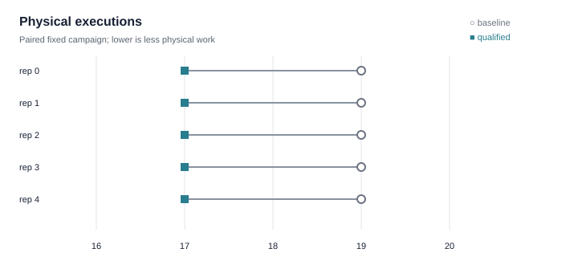
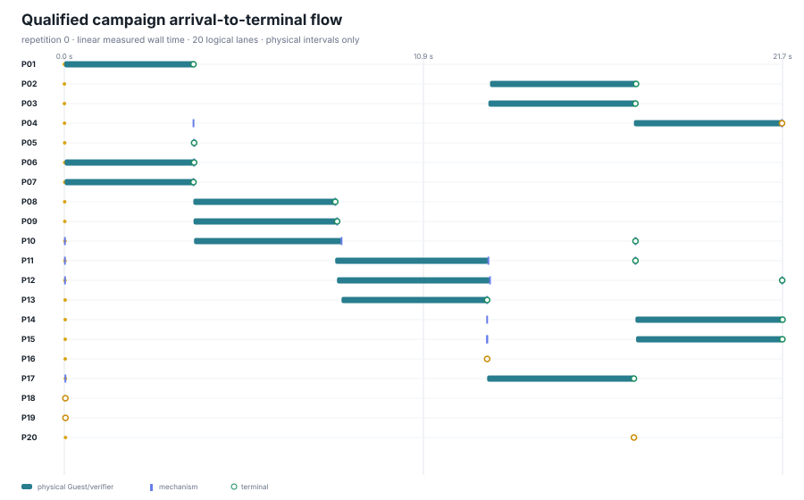

# Authority-transparent campaign results

## Conclusion

Across 5 paired repetitions of the fixed 20-program campaign, qualified execution used a median of 17 physical executions versus 19 for baseline: a paired reduction of 2 executions (10.5%). Median wall time was 22.00 s versus 25.73 s; this descriptive small-sample result is not a production throughput claim.

| Treatment | Physical executions, median [min, max] | Wall time, median [min, max] | Process CPU, median [min, max] |
|---|---:|---:|---:|
| Baseline | 19 [19, 19] | 25.73 s [25.34, 26.32] | 70.26 s [68.95, 71.70] |
| Qualified | 17 [17, 17] | 22.00 s [21.70, 22.55] | 66.38 s [65.52, 67.90] |

## Provenance

- Campaign source: 40882ca5a818f4c5388bdeebe7d36ee9dc5fe7c5
- Guest artifact: sha256:0a37a963a09b4e763cb6a40886a771e9c13e2f6a9d3a2d295788752e319c5795
- Guest artifact source: ae922641cd9c539b68a0ea7110b5dc205e5c9a8a
- Manifest: sha256:0633e6d98dd67fee6a2aad12cfd491a6d14e5344d5d2d78d91c059e62ec0fe7e
- Host: darwin/arm64; go1.26.0; Darwin 25.4.0 Darwin Kernel Version 25.4.0: Thu Mar 19 19:31:09 PDT 2026; root:xnu-12377.101.15~1/RELEASE_ARM64_T8132
- Evidence strength: paired repetitions, full min–max shown; no confidence interval inferred.

## Claim boundary

**Valid:** For this fixed 20-program campaign on one recorded host, exact qualified sharing reduced physical executions while preserving every registered oracle and authority rejection.

**Invalid inference:** Do not generalize these five paired repetitions to arbitrary workloads, hosts, schedulers, or steady-state production throughput.

## Qualified arrival-to-terminal flow

## Fixed 20-case contract

| ID | Family | Release | Typed operation | Actual admission | Actual terminal |
|---|---|---:|---|---|---|
| P01 | authority bifurcation | +0 ms | execute python | admitted | complete |
| P02 | authority bifurcation | +4 ms | consume result | admitted | complete |
| P03 | authority bifurcation | +4 ms | consume result | admitted | complete |
| P04 | authority bifurcation | +6 ms | consume result | admitted | cancelled |
| P05 | exact sharing | +10 ms | exact request | admitted | complete |
| P06 | exact sharing | +10 ms | exact request | admitted | complete |
| P07 | exact sharing | +11 ms | exact request | admitted | complete |
| P08 | exact sharing | +12 ms | exact request | admitted | complete |
| P09 | exact sharing | +13 ms | exact request | admitted | complete |
| P10 | root verification | +18 ms | verify workspace | admitted | complete |
| P11 | root verification | +19 ms | verify workspace | admitted | complete |
| P12 | root verification | +20 ms | verify workspace | admitted | complete |
| P13 | authority resume | +25 ms | start workflow | admitted | complete |
| P14 | authority resume | +26 ms | resume workflow | admitted | complete |
| P15 | authority resume | +27 ms | resume workflow | admitted | complete |
| P16 | authority resume | +28 ms | resume workflow | authority_expired | rejected |
| P17 | delegation attenuation | +32 ms | delegate child | admitted | complete |
| P18 | delegation attenuation | +33 ms | delegate child | authority_widening | rejected |
| P19 | delegation attenuation | +34 ms | delegate child | delegation_budget | rejected |
| P20 | delegation attenuation | +35 ms | delegate child | parent_terminal | cancelled |

## Observed logical-to-physical identity

| Logical cases | Qualified physical identity | Observed boundary |
|---|---|---|
| P05 / P06 | campaign-exact-2 / campaign-exact-2 | exact request identity reused one physical Guest result |
| P10 / P11 | campaign-verifier-17 / campaign-verifier-17 | exact sealed-root verifier identity reused one verifier execution |
| P18 / P19 / P20 | none | rejected or cancelled before physical execution |
