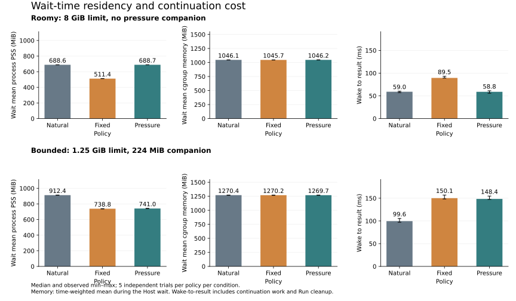

# Wait-residency pilot

## Result

All **30/30 trials completed correctly**. In this workload, proactive paging reduced the benchmark worker's PSS but did not demonstrate lower total cgroup memory. It increased the time from Host wait release to the result.

Keep residency advice opt-in. These results do not justify enabling it as a default performance optimisation.



Each bar is a median of five independent worker trials. Whiskers show the observed minimum and maximum. Memory measurements are time-weighted means over the Host wait. Worker PSS includes the pressure companion when enabled; cgroup memory also includes the harness parent and charged page cache.

| Condition | Policy | Worker PSS (MiB) | Cgroup memory (MiB) | Wake to result (ms) |
|---|---|---:|---:|---:|
| Roomy | natural | 688.6 | 1046.1 | 59.0 |
| Roomy | fixed | 511.4 | 1045.7 | 89.5 |
| Roomy | pressure | 688.7 | 1046.2 | 58.8 |
| Bounded | natural | 912.4 | 1270.4 | 99.6 |
| Bounded | fixed | 738.8 | 1270.2 | 150.1 |
| Bounded | pressure | 741.0 | 1269.7 | 148.4 |

Paired within-block comparisons against natural:

- Roomy/fixed: median worker-PSS reduction 25.7%; wake-to-result increased by 32.0 ms. Median paired cgroup-memory change was -0.017%.
- Roomy/pressure: no advice was issued. The policy behaved like natural under low occupancy.
- Bounded/fixed: median worker-PSS reduction 19.0%; wake-to-result increased by 50.4 ms.
- Bounded/pressure: median worker-PSS reduction 18.8%; wake-to-result increased by 49.5 ms. Median paired cgroup-memory change was -0.049%.

Swap accounting increased in the advised arms. The PSS reduction therefore does not establish an equivalent reduction in the job's memory charge. The paired percentages above are medians of paired trial differences, rather than ratios of the table's medians. Five repetitions do not support a tail-latency estimate or a capacity claim.

## Workload and controls

- Runtime implementation: `d174af1c4a46d685a0073b0916ff6bc745e64f7f`.
- Guest: the qualified `numpy-core` growable artifact built from `53eeb71b`; its identity is recorded once in each JSONL metadata row.
- Linux x86_64, kernel 6.17, T4 partition; two allocated CPUs and `GOMAXPROCS=2`. No GPU computation was used. The node had 4 GiB of swap.
- One real Python/NumPy Run per worker: allocate and touch a 64 MiB int64 array, compute, wait on `testio.wait()` for 2 seconds, read/sum the array again, and validate exact results.
- Every arm uses COW preparation, the same warmup and fresh worker process. PLM is disabled for this comparison. Engine compilation and common warmup are recorded as setup, outside `run_ns`.
- `run_ns` includes the measured `Engine.Run` and its internal cleanup. `wake_to_result_ns` runs from Host wait release to `Engine.Run` return, including continuation computation. Extra pressure-companion cleanup and engine shutdown are recorded separately.
- Fixed and pressure policies use `ColdAfter=100ms` and `PageOutAfter=300ms`. Pressure uses a cgroup occupancy threshold of 0.8.
- Roomy condition: 8 GiB job limit, no companion.
- Bounded condition: 1280 MiB job limit and the same 224 MiB anonymous-mmap companion in every arm. The companion is a controlled synthetic load, held through each trial and then stopped, joined and unmapped.
- Five randomized blocks per condition, with each arm run once per block. Workers run serially. Seed: `20260919`.

Only compare policies within a condition: both the budget and the companion differ between conditions. Wait samples stop before the Host handler returns, while the Guest is still alive. They do not describe post-resume memory or memory after Guest teardown.

## Files and reproduction

- Raw observations: [roomy JSONL](data/roomy.jsonl), [bounded JSONL](data/bounded.jsonl).
- Derived tables: [roomy](summary/roomy/), [bounded](summary/bounded/). These include trial counts, paired deltas and observed ranges.
- Runner: [`cmd/residency-bench`](../../cmd/residency-bench/).
- Analysis: [`scripts/analyze-residency.py`](../../scripts/analyze-residency.py), using only the Python standard library.
- Figure: [`scripts/plot-residency.py`](../../scripts/plot-residency.py), with matplotlib as a plotting-only dependency.
- Policy and measurement details: [residency guide](../../docs/residency.md).

On Linux with a matching qualified Guest bundle, build the runner and run each command inside its corresponding cgroup limit:

```sh
go build -o /tmp/residency-bench ./cmd/residency-bench
/tmp/residency-bench -guest "$GUEST" -output roomy.jsonl \
  -blocks 5 -seed 20260919 -workloadMiB 64 -waitMs 2000 \
  -pressureMiB 0 -cold 100ms -pageout 300ms -pressureThreshold 0.8
/tmp/residency-bench -guest "$GUEST" -output bounded.jsonl \
  -blocks 5 -seed 20260919 -workloadMiB 64 -waitMs 2000 \
  -pressureMiB 224 -cold 100ms -pageout 300ms -pressureThreshold 0.8
```

From the repository root:

```sh
python scripts/analyze-residency.py research/residency/data/roomy.jsonl --output-dir research/residency/summary/roomy
python scripts/analyze-residency.py research/residency/data/bounded.jsonl --output-dir research/residency/summary/bounded
uv run --with matplotlib python scripts/plot-residency.py
```

Artifact paths and cgroup identifiers in the published JSONL were replaced with a filename and leaf-to-root level labels. Numeric observations, outcomes, sample ordering and paired summaries were preserved exactly. Failed development smokes were kept separately and were not substituted for any of these 30 scheduled trials.
